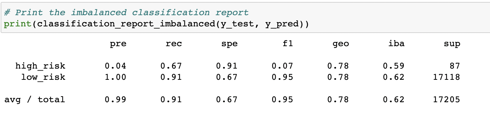

# Credit Risk Analysis
## Overview
This analysis focuses on credit risk, an inherently unbalanced classification problem, with safe loans heavily outweighing risky loans. Using different methods to train and evaluate unbalanced models, we will find the most effective resampling algorithm. Resampling will allow us to balance lopsided datasets through oversamppling, undersampling, combination sampling, and ensemble classifiers. These models will be measured for accuracy, precision and sensitivity, to determine the effectiveness of each model and which model is best suited for predicting credit risk. Accuracy is the number of correct predicitions divided by the number of totaly predictions. Predictions in this analysis have binary outcomes: Good Loan or Bad Loan, and can be categorized into true positives (TP), false positives (FP), true negatives (TN), and false negatives (FN). 

Precision and sensitivity are performance metrics that will give us an idea on how accurate each resampling model is. Precision is how certain we are of our true positives while recall, or sensitivity, is how certain we are of not missing any positives. We focus on predictions when using precision. That is, we divide our total positives by all we labeled positive. Precision can be used to seperate regular emails and spam emails. High precision tests result in predicted positives likely being true positives, risking not finding all true positives.   

- Precision = TP/(TP+FP)

We focus on truth when using recall. We find our level of sensitivity when we divide the total number of correct positives by the actual number of positives. Sensitivity is best used when screening for diseases. It is better to know how many people who actually have an illness are correctly diagnosed. Sensitivity tests tend to be more aggressive in order to detect intended targets. They risk finding multiple false positives. 

- Recall = TP/(TP+FN)

The F1 score summarizes precision and sensitivity together. It seeks to find a balance between the two. A strong imbalance between sensitivity and precision results in a low F1 score. 

- F1 = 2(Precision * Sensitivity) / (Precision + Sensitivity)

All of these testing methods will be used to determine which resamplng model is best suited for the credit risk analysis. 

## Results
In this analysis we use a csv file containing data on loan statistics from Q1 of 2019. These data include our target variable which has numerical data stating whether or not a loan is good or bad. Class imbalance is evident in this data because good loans heavily outwiegh bad loans, and the data is not represented equally. This can cause machine learning models to biased toward the larger class. In order to prevent any bias and run accurate tests in predicting loans, we will use a variety of resampling models to balance our data. 

### Oversampling
First we will implement oversampling techniques. This involves adding more instances to the smaller class. In this case risky loans will recieve more instances to balance their data against good loans. 

#### Random Oversampling
In random oversampling, instances are randomly added to the minority class until it has equal representation with the majority class. 

#### SMOTE (Synthetic Minority Oversampling Techniques)
In SMOTE the size of the minority class is also increased, however the instances are generated by choosing numbers that are the closer numbers to data values already included. 

### Undersampling
Undersampling is the opposite of oversmapling. Instead of adding instances to the minority class, undersampling takes instances away from the majority class. The size of the heavier class is decreased. In this resampling model, no data values are formed sythetically or randomly. Instead, real data is used. 

#### Cluster Centroid 
In Cluster Centroid undersampling, the model seeks clusters of data from the majority class then generates a sample of data points from these clusters to represent the population. The majority class is then undersampled to equally run against the minority class. 

### Combination Sampling
Combination sampling combines both oversampling and undersampling. 

#### SMOTEENN (SMOTE + Edited Nearest Neighbors)
SMOTEENN oversamples the smaller class using SMOTE, and then filters the resulting data with undersampling. If two nearest neighbors of a data point come from different classes, that data point will be dropped. 

### Ensemble Classifiers
Ensemble classfiers improve machine learning resulting in more efficient predictive models. They combine learning methods to find more predictive performance models.

#### Balanced Random Forest
Random Forest ensembling generate base learners parallel. When learners are ran together they decrease erros faster. 

#### Easy Ensemble
Easy Ensemble is acheived through random undersampling.

## Summary
After running all of the resampling models and ensemble classifiers we can now choose the best model best fit to predict credit risk. The most accuarate oversampling model is Random Oversampling with a balanced accuarcy of 64.6%, precision of 99%, recall of 68% and a F1 score of 81%. The Cluster Centroid Undersampling has an accuracy of 52.9%, precision of 99%, recall of 45% and a F1 score of 62%. Combination sampling has an accuracy of 64.0%, precision of 99%, recall of 58% and a F1 score of 73%. Both ensemble classifiers have the same results: accuarcy of 78.8%, precision of 99%, recall of 91% and a F1 score of 95%. 
The best algorithm for predicting credit risk is ensemble classification due to higher accuary, precision, and sensitivity. 
